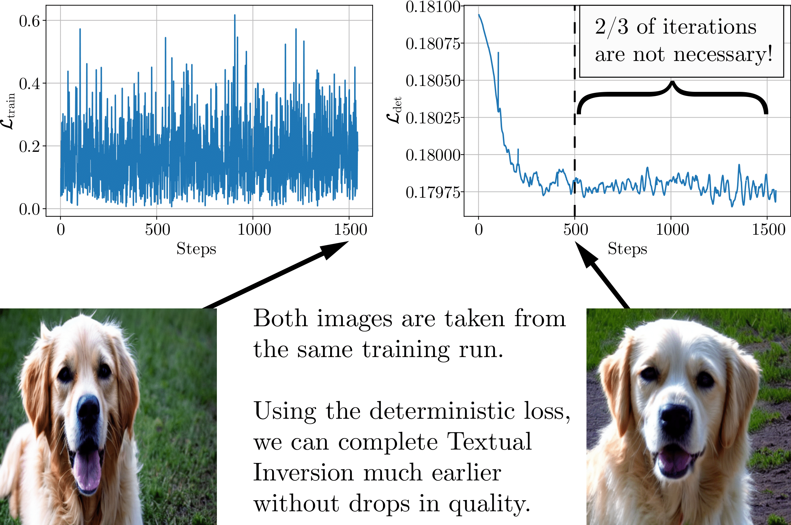

# Is This Loss Informative? Speeding Up Textual Inversion with Deterministic Objective Evaluation

[](https://arxiv.org/abs/2302.04841)

In our work we propose a simple evaluation objective that allows to speed up Textual Inversion by 10-15 times without significant drop in quality. This repository contains the official code and data for [our paper](https://arxiv.org/abs/2302.04841). 

<p align="center">

</p>

## Setup

Before running the scripts, make sure to install the project dependencies:

```bash
pip install -r requirements.txt
```

In order to run experiments on Stable Diffusion, one needs to accept the model's license before downloading or using the weights. In our work, we use model version `v1-5`. To reproduce the presented results, you need to visit the [model page on Hugging Face Hub](https://huggingface.co/runwayml/stable-diffusion-v1-5), read the license and tick the checkbox if you agree. 

You have to be a registered user on the Hugging Face Hub, and you will also need to use an access token for the code to work. For more information on access tokens, please refer to [this section of the documentation](https://huggingface.co/docs/hub/security-tokens).

Run the following command to authorize:

```bash
huggingface-cli login
```

## Data
The full dataset combining 83 concepts from our manually curated subset of [Imagenet-R](https://github.com/hendrycks/imagenet-r) and 9 concepts from the [original work](https://github.com/rinongal/textual_inversion/#pretrained-models--data) can be downloaded [here](https://drive.google.com/drive/folders/1ZsU_PJkEOaeQreV7SjfDNAibFleUB6ib?usp=sharing). 
Below, we show an example of running our experiments with the "cat_statue" concept.

## Main experiments
Our work is based on [Textual Inversion](https://arxiv.org/abs/2208.01618) paper and its [diffusers implementation](https://github.com/huggingface/diffusers/tree/main/examples/textual_inversion).
The following commands can be used to reproduce the results presented in Table 1 of our paper. 
In order to reproduce results from Table 2, please run the "Baseline" method with varying `--init_strategy` parameter value (note that `--init_strategy=manual` requires specifying `--initialization_token`). 
To obtain numbers from Table 3, please also specify `--optimizer sam` in the baseline training script.
### Baseline

```bash
export CUDA_VISIBLE_DEVICES="your-gpus"

python textual_inversion.py \
  -m [sd/ldm] \
  --train_data_dir="path-to-cat_statue-images" \
  --placeholder_token="inversion-cat_statue" \
  --init_strategy best \
  --train_batch_size=[4/8] \
  --save_steps 500 \
  --max_train_steps 6100 \
  --learning_rate 5e-3 \
  --scale_lr \
  --log_unscaled \
  --sample_frequency 500 \
  --n_val_prompts 8 \
  --variant vanilla \
  --mixed_precision fp16 \
  --logger wandb \
  --seed 59
```

### Few iters

```bash
export CUDA_VISIBLE_DEVICES="your-gpus"

python textual_inversion.py \
  -m [sd/ldm] \
  --train_data_dir="path-to-cat_statue-images" \
  --placeholder_token="inversion-cat_statue" \
  --init_strategy best
  --train_batch_size=4 \
  --save_steps 100 \
  --max_train_steps [445/750] \
  --learning_rate 5e-3 \
  --scale_lr \
  --sample_frequency -1 \
  --n_val_prompts 8 \
  --variant short_iters \
  --mixed_precision fp16 \
  --logger wandb \
  --seed 59
```

### CLIP-s

```bash
export CUDA_VISIBLE_DEVICES="your-gpus"

python textual_inversion.py \
  -m [sd/ldm] \
  --train_data_dir="path-to-cat_statue-images" \
  --placeholder_token="inversion-cat_statue"
  --init_strategy best
  --train_batch_size=4 \
  --save_steps 50 \
  --max_train_steps 6100 \
  --learning_rate 5e-3 \
  --scale_lr \
  --sample_frequency 50 \
  --n_val_prompts 8 \
  --variant clip_early_stopping \
  --early_stop_eps 0.05 \
  --early_stop_patience 5 \
  --mixed_precision fp16 \
  --logger wandb \
  --seed 59
```

### DVAR
```bash
export CUDA_VISIBLE_DEVICES="your-gpus"

python textual_inversion.py \
  -m [sd/ldm] \
  --train_data_dir="path-to-cat_statue-images" \
  --placeholder_token="inversion-cat_statue"
  --init_strategy best
  --train_batch_size=4 \
  --eval_batch_size=4 \
  --save_steps 100 \
  --max_train_steps 6100 \
  --learning_rate 5e-3 \
  --scale_lr \
  --sample_frequency -1 \
  --n_val_prompts 8 \
  --variant dvar_early_stopping \
  --early_stop_eps 0.39 \
  --early_stop_patience 282 \
  --mixed_precision fp16 \
  --logger wandb \
  --seed 59
```
## Semi-deterministic experiments
This section shows how to set up experiments for Section 4.4 of our work.
The `exp_code` parameter is a binary code with each digit corresponding to each of the 5 main parameters of the evaluation batch (images/latents/noise/captions/timesteps) being deterministic (1) or random (0). 
For example, `exp_code=10101` means that every evaluation batch will have the same set of images, random noise tensors and timesteps for the diffusion process, but latents and captions will be resampled on each iteration.
To get the effective size of the validation batch as big as 512, one can vary the `--eval_gradient_accumulation_steps` parameter.

```bash
export CUDA_VISIBLE_DEVICES="your-gpus"

python textual_inversion.py \
  --max_train_steps 2500 \
  -m [sd/ldm] \
  --train_data_dir="path-to-cat_statue-images" \
  --placeholder_token="inversion-cat_statue" \
  --init_strategy best \
  --train_batch_size=4 \
  --eval_batch_size=8 \
  --save_steps 100 \
  --learning_rate 5e-3 \
  --scale_lr \
  --sample_frequency 50 \
  --n_val_prompts 8 \
  --variant dvar_early_stopping \
  --early_stop_eps 0 \
  --early_stop_patience 2501 \
  --exp_code 11110
  --n_val_prompts 8 \
  --mixed_precision fp16 \
  --eval_gradient_accumulation_steps 2 \
  --logger wandb \
  --seed 59
```
## Citation
If you make use of our work, please cite our paper:

```
@misc{voronov2023loss,
    title={Is This Loss Informative? Speeding Up Textual Inversion with Deterministic Objective Evaluation},
    author={Anton Voronov and Mikhail Khoroshikh and Artem Babenko and Max Ryabinin},
    year={2023},
    eprint={2302.04841},
    archivePrefix={arXiv},
    primaryClass={cs.CV}
}
```
