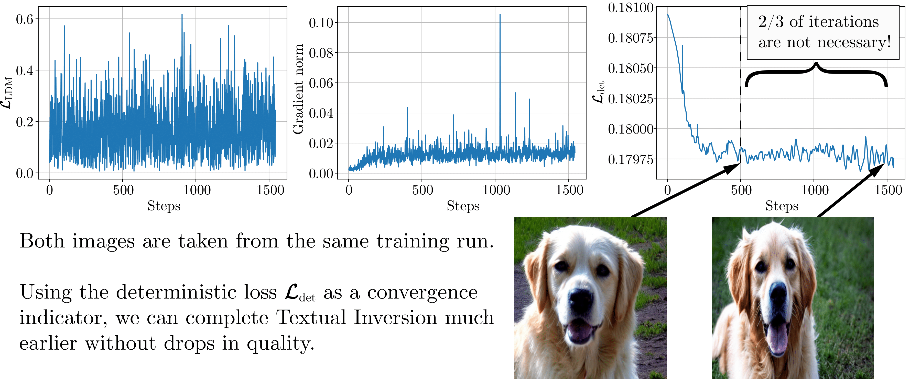

# Is This Loss Informative? Faster Text-to-Image Customization by Tracking Objective Dynamics

[](https://arxiv.org/abs/2302.04841)

In this work, we propose a simple evaluation objective that allows to speed up text-to-image customization techniques (Textual Inversion, DreamBooth, Custom Diffusion) by 2-8 times without a significant drop in quality. 
This repository contains the official code and data for our paper. 

<p align="center">

</p>

## Setup

Before running the scripts, make sure to install the project dependencies:

```bash
pip install -r requirements.txt
```

In order to run experiments on Stable Diffusion, one needs to accept the model's license before downloading or using the weights. In our work, we use model version `v1-5`. To reproduce the presented results, you need to visit the [model page on Hugging Face Hub](https://huggingface.co/runwayml/stable-diffusion-v1-5), read the license and tick the checkbox if you agree. 

You have to be a registered user on the Hugging Face Hub, and you will also need to use an access token for the code to work. For more information on access tokens, please refer to [this section of the documentation](https://huggingface.co/docs/hub/security-tokens).

Run the following command to authorize:

```bash
huggingface-cli login
```

## Data
In our work we conduct experiments on the 9 concepts released by the authors of [Textual Inversion](https://github.com/rinongal/textual_inversion/#pretrained-models--data), 9 concepts from [Custom Diffusion](https://github.com/adobe-research/custom-diffusion#getting-started) and 30 concepts found in official [DreamBooth repository](https://github.com/google/dreambooth/tree/main/dataset). 
Below, we show an example of running our experiments with the "cat_statue" concept.

## Main experiments
Our work analyzes three methods of text-to-image customization: [Textual Inversion](https://arxiv.org/abs/2208.01618), [DreamBooth](https://arxiv.org/abs/2208.12242) and [Custom Diffusion](https://arxiv.org/abs/2212.04488). 
In this repository, we combine our proposed improvements with the diffusers implementation of [Textual Inversion](https://github.com/huggingface/diffusers/tree/main/examples/textual_inversion), original [Custom Diffusion](https://github.com/adobe-research/custom-diffusion) code and a parameter-efficient [DreamBooth-LoRA](https://huggingface.co/docs/peft/task_guides/dreambooth_lora#finetuning-dreambooth) implementation.
The following commands can be used to reproduce the results presented in Table 1 of our paper (remove `--center_crop` option when using `--method custom`).
### Baseline
```bash
python textual_inversion.py \
  --method [inversion/custom/dreambooth] \
  --variant vanilla \
  --train_data_dir="path-to-cat_statue-images" \
  --placeholder_token="inversion-cat_statue" \
  --initializer_token ktn \
  --save_steps 6101 \
  --center_crop \
  --max_train_steps [6100/500/1000] \
  --learning_rate [5e-3/1e-5/5e-4] \
  --scale_lr \
  --sample_frequency [500/100/100] \
  --n_train_prompts 8 \
  --mixed_precision fp16 \
  --logger wandb \
  --sample_steps 50 \
  --n_images_per_val_prompt 2 \
  --seed 59 \
  --guidance [7.5/6/6] \
  --class_prompt cat_statue \
  --class_data_dir="path-for-regularization-imgs" 
```
### CLIP Early Stopping
```bash
python textual_inversion.py \
  --method [inversion/custom/dreambooth] \
  --variant clip_early_stopping \
  --train_data_dir="path-to-cat_statue-images" \
  --placeholder_token="inversion-cat_statue" \
  --initializer_token ktn \
  --max_train_steps [6100/500/1000] \
  --save_steps 6100 \
  --center_crop \
  --learning_rate [5e-3/1e-5/5e-4] \
  --scale_lr \
  --sample_frequency 50 \
  --n_train_prompts 8 \
  --early_stop_patience [6/6/3] \
  --early_stop_eps [0.02/0.02/0.04] \
  --mixed_precision fp16 \
  --logger wandb \
  --sample_steps [50/50/200] \
  --n_images_per_val_prompt 2 \
  --seed 59 \
  --guidance [7.5/6/6] \
  --class_prompt cat_statue \
  --class_data_dir="path-for-regularization-imgs" 
```
### Few iters
```bash
python textual_inversion.py \
  --method [inversion/custom/dreambooth] \
  --variant short_iters \
  --train_data_dir="path-to-cat_statue-images" \
  --placeholder_token="inversion-cat_statue" \
  --initializer_token ktn \
  --max_train_steps [475/367/450] \
  --save_steps 6100 \
  --center_crop \
  --learning_rate [5e-3/1e-5/5e-4] \
  --scale_lr \
  --sample_frequency -1 \
  --n_train_prompts 8 \
  --mixed_precision fp16 \
  --logger wandb \
  --sample_steps [50/50/200] \
  --n_images_per_val_prompt 2 \
  --seed 59 \
  --guidance [7.5/6/6] \
  --class_prompt cat_statue \
  --class_data_dir="path-for-regularization-imgs" 
```
### DVAR

```bash
python textual_inversion.py \
  --method [inversion/custom/dreambooth] \
  --variant dvar_early_stopping \
  --train_data_dir="path-to-cat_statue-images" \
  --placeholder_token="inversion-cat_statue" \
  --initializer_token ktn \
  --max_train_steps [6100/500/1000] \
  --save_steps 6100 \
  --center_crop \
  --learning_rate [5e-3/1e-5/5e-4] \
  --scale_lr \
  --sample_frequency -1 \
  --n_train_prompts 8 \
  --early_stop_patience [310/180/440] \
  --early_stop_eps [0.15/0.15/0.4] \
  --mixed_precision fp16 \
  --logger wandb \
  --sample_steps [50/50/200] \
  --n_images_per_val_prompt 2 \
  --seed 59 \
  --guidance [7.5/6/6] \
  --class_prompt cat_statue \
  --class_data_dir="path-for-regularization-imgs" 
```
## Other experiments
This section shows how to set up experiments for Section 4.5 of our work.
### Semi-deterministic experiments
The `exp_code` parameter is a binary code with each digit corresponding to each of the 5 main parameters of the evaluation batch (images/latents/noise/captions/timesteps) being deterministic (1) or random (0). 
For example, `exp_code=10101` means that every evaluation batch will have the same set of images, random noise tensors and timesteps for the diffusion process, but latents and captions will be resampled on each iteration.
To get the effective size of the validation batch as big as 512, one can vary the `--eval_gradient_accumulation_steps` parameter.

```bash
python textual_inversion.py \
  --max_train_steps 2500 \
  --method inversion \
  --train_data_dir="path-to-cat_statue-images" \
  --placeholder_token="inversion-cat_statue" \
  --initializer_token ktn \
  --eval_batch_size=8 \
  --save_steps 6100 \
  --learning_rate 5e-3 \
  --scale_lr \
  --sample_frequency -1 \
  --variant dvar_early_stopping \
  --early_stop_eps 0 \
  --early_stop_patience 2501 \
  --exp_code 11110 \
  --n_train_prompts 8 \
  --mixed_precision fp16 \
  --eval_gradient_accumulation_steps 2 \
  --logger wandb \
  --seed 59
```
### Fixed timesteps correlations
The only additional "--triple" command needed, then "eval_loss_begin", "eval_loss_middle", "eval_loss_end" will be logged.

```bash
python textual_inversion.py \
  --max_train_steps 1500 \
  --method inversion \
  --train_data_dir="path-to-cat_statue-images" \
  --placeholder_token="inversion-cat_statue" \
  --initializer_token ktn \
  --eval_batch_size 4 \
  --save_steps 1501 \
  --learning_rate 5e-3 \
  --scale_lr \
  --sample_frequency 50 \
  --variant dvar_early_stopping \
  --triple \
  --early_stop_patience 1501 \
  --n_train_prompts 8 \
  --mixed_precision fp16 \
  --eval_gradient_accumulation_steps 2 \
  --logger wandb \
  --seed 59
```
## Citation
If you make use of our work, please cite our paper:

```
@misc{voronov2023loss,
    title={Is This Loss Informative? Speeding Up Textual Inversion with Deterministic Objective Evaluation},
    author={Anton Voronov and Mikhail Khoroshikh and Artem Babenko and Max Ryabinin},
    year={2023},
    eprint={2302.04841},
    archivePrefix={arXiv},
    primaryClass={cs.CV}
}
```
